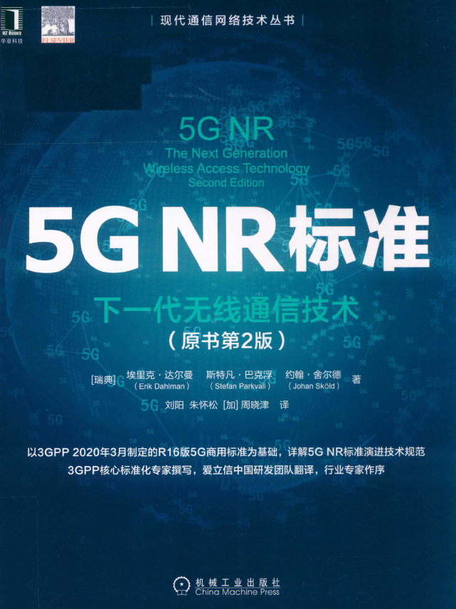
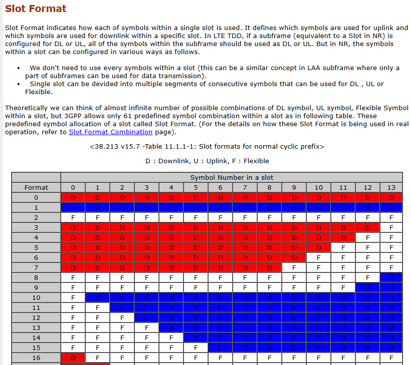

# Cellular systems - 5G and beyond Part 1
### Stefan Parkval, IEEE fellow, Sernior Expert Ericsson Research

??? note "About Lecturer"

    Also one of the authors of

    

???+ info

    Grimeton: 
        
    One of the earlist long-wave radio transmitters in Sweden, world heritage, with 127m-high, 1.9km-long antenna.

## 1.Intro

mobile broadband started since 4G

5G - beyond smartphones

6G - intelligient communication erver-presenting

## 2.Cellular netwrok
2 basic factor: coverage, mobility

### 2.1 Spectrum

lower bands(sub6): reasonable bandwidth(20 MHz or so), good coverage, typically fdd

higer bands: wide bandwidth(100MHz or so) -> high data rates, coverage (bad pathloss, beamforming crucial), typically tdd

NR 3GHz ~ 30GHz

???+ note "**why high frequency TDD?**"

    most important: regulations,
    
    historical reasons,
    
    technically: 
    
    1. UL/DL switch require guard time, in low frequency, guardtime is too long;
    
    2. high frequency, seperation of adjacent frequency is harder. TDD does not have that problem.

licensed and unlicensed

### 2.2 Cellular

- inter-site distance: 
    
    100-300m dense urban 
    
    ~ kms rural

- power: 

    dl 20~200W macro, < 1W indoor

    ul 200 mW

reuse 1: ICI

???+ note "ICI in TDD"

    DL to UL, UL to DL ICI
    
    solution: synchronization ( <3 micro seconds, $\mu s$)

    There is guard period to tolerate synchronization shift
    
    - Intersting problem: how about in numerology 6? 
        
        in this case, the cell is much smaller, and beamforming existing, naturally canceling a large part of ICI

### 2.3 LTE waveform and frame structure                  

dl: plain OFDM

ul: DFT-precoded OFDM, to reduce PAPR (Peak-to-Average Power Ratio) 

1 subframe consists of 14 symbols (multipath delay shift<4.7ms is ok )

### 2.4 Channel-dependent scheduling

- circuit-switched / packet switched (now)

- scheduling: schedule each subframe(1ms): whom? what rate? rate adaptations.

    Basic idea:

    in time:
    transmit fading peaks

    in time-freq:
    2D peak

- how to schedule?

    dl: UEs report CSI (10ms), and data amount
    
    ul: scheduling request, indicating data presence, then BS requests buffer status and so on, and schedule RBs

### 2.5 Error

not due to congestion, but fading

**"hide"** error from TCP

HARQ in MAC, and ARQ in RLC

retransmission scheduled a few ms later, use outband (PUSCH?)

### 2.6 Battery lifetime

radio is power consuming

RRC_IDLE, RRC_INACTIVE(NR only, with RRC context, coreNet connection, but no data transfoer ), RRC_Conected. In 5G, RRC_Inactive is used to reduce frequent signalling.

### 2.7 Connection

RRC_IDLE -> cell search

scan for synchronization signals (PSS and SSS, every 5ms in 4G, good self-correlated sequence)

once found, get sync-ed, know the start of frames, read systems informations (cell ID)

in 5G, synchronizaiotn signal interval increased to 20ms, for power efficency (part of commercial reason)

once connect, random access, preamble transmission -> random access response

### 2.8 Mobility

connected state mobility: network decides, network knows UE's cell

idle state mobility: UE determines, BS does not know UE's location cell 

## 3. LTE evolusion

Rel-8/9 ~ Rel-15, but stopped now, switched to 5G/6G

- CA is the most useful feature introduced in 4G
    - exploitation of fragmented specturm
    - higher data rate

- Licence assist comm: aggregate liscensed and unlicenced, listen before talk on unlicenced

???+ note "About IoT"

    mMTC, cat-M and NB-IoT

    - mMTC (massive Machine-Type Communication)

        A **service category** in 5G that enables the connection of a vast number of IoT devices with low power consumption and sporadic small data transmissions. NB - IoT is a part of 5G, while NB-IoT is a part of 4G.
    
    - Cat-M (Category M, or LTE-M)

        A 4G LTE-based **technology** optimized for IoT.

        Supports higher data rates (up to ~1 Mbps) and mobility compared to NB-IoT.

        Allows voice support (VoLTE)

    - NB-IoT (Narrowband IoT)

        A low-power wide-area **technology** designed for deep indoor coverage and long battery life.

        Supports very low data rates (~100 kbps or less), making it ideal for applications like smart meters, environmental monitoring, and industrial sensors.

        Operates in licensed LTE spectrum but does not support handovers or voice services.

## 4. 5G NR

- ultra-lean design: reduce control overheads
- wide spectrum
- multi-antenna
- low lattency
- forward compatibility (good job, 6G based on 5G)

- LTE-NR coexistence
- Network slicing (service-based slicing)
    
    slice happens in coreNet, basically assign a slice ID to each packet/session(and deploy different schedule policies)

    interesting: 5G SA core is required to support this feature, but NSA is first released, so some operators choosed NSA to reduce coreNet cost instead of choosing SA and having more 5G capabilities.

- modular architecture: DU/CU, CP(anel)/UP

- Dynamic TDD: 

    ???+ note "slot format"

        

    consideration: since not full synchronized, inteference matters

    macro: semi-static, reduce ici

    small cell: dynamic, more free without serious ici

- multianntenna

    common toolbox

- beamforming (spatial filter)

    challening to point in the right dir, also challenging when moving fast

    FR1: digital beamforming, across arbitary bandwidth

    FR2: Hybrid (数模混合波束赋形), more limitation in frequency

- Ericsson spectrum sharing

    for introducing 5G in 4G, smooth network migration

    books 5G/5G-advanced...