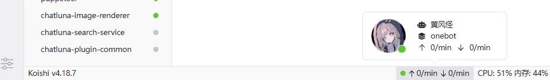
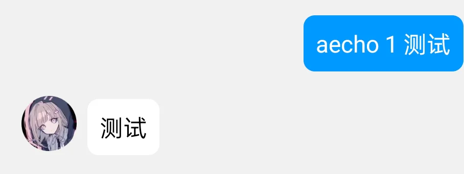
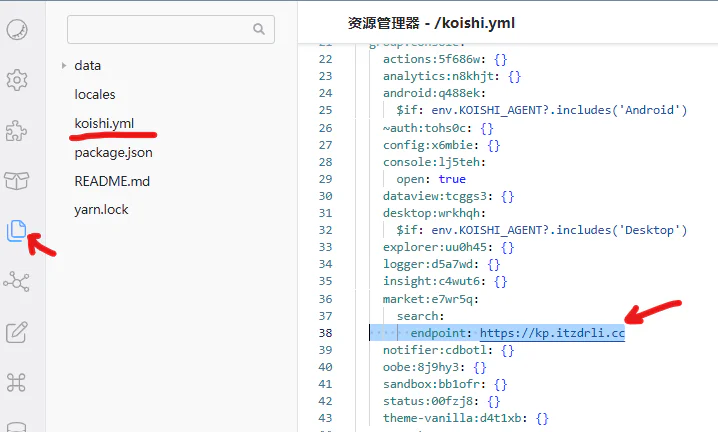

# QQ机器人
### qq官方是禁止此类个人账号接入机器人的，所以有封号风险，大家别拿大号玩

记录一下用阿里云+linux qq+napcat+koishi+ChatLuna实现用qq小号接入deepseek聊天的过程，之前其实也用过chatgpt的api，但是国内的服务器设置梯子还是不太稳定，clash运行了两个月崩了，国内api还是方便呀。由于我也是业余所以教程都是别人的（

前一半教程实际上来自[丫丫博客](https://blog.yaqwq.top/402.html)

###工具：
```
1. 一个ubuntu linux服务器
2. Xshell，用来ssh连服务器
3. Deep seek api，在官网右上角API开放平台，付费但是比较便宜
```

### 安装docker
ssh连接上服务器
```
bash <(curl -sSL https://linuxmirrors.cn/docker.sh)
```

### 修改docker镜像源
用阿里云的话，有阿里云的镜像加速器：[容器镜像服务-镜像加速器](https://cr.console.aliyun.com/cn-hangzhou/instances/mirrors)

### 安装[NapCatQQ](https://napneko.github.io/guide/napcat)
```
docker run -d \
-e MESSAGE_POST_FORMAT="string" \
-e WSR_ENABLE=true \
-p 6099:6099 \
-v /root/napcat/config:/usr/src/app/napcat/config \
-v /root/napcat/.config:/root/.config \
--name napcat \
mlikiowa/napcat-docker:latest
```
浏览器访问```<服务器公网IP>:6099```, 若出现”{“msg”:”NapCat WebAPI is now running!”}“即代表成功

### 登录QQ
浏览器访问 ```<服务器公网IP>:6099/webui```，需要输入token

在ssh使用命令```docker logs napcat | grep WebUi```, 找到类似于```[NapCat] [WebUi] WebUi Local Panel Url: http://127.0.0.1:6099/webui?token=xxxxxxxx```的记录，最后一串就是token

复制并输入进webui，手机qq小号扫码登录

此时在ssh使用命令```docker attach napcat``` (napcat是这个docker的名字)可以看到一大堆滚动的消息记录，因为刚登录qq会接收近期消息

### 安装[Koishi](https://koishi.chat/zh-CN/manual/introduction.html)，一个聊天机器人框架

运行
```
docker run -p 5140:5140 \
--network host \
--name my_koishi \
koishijs/koishi

```
安装成功显示“欢迎使用 Koishi！ ......在您点击[同意]前，telemetry服务不会启动。”

这里使用--network host模式的docker是让docker和宿主机使用相同的网络栈，后面如果需要配置梯子，比如用linux端Clash，比较方便

浏览器访问```<服务器公网IP>:5140```，进入koishi的webui，点击同意

### 安装并配置qq所需的koishi插件
点击“依赖管理”，然后点击小火箭，再点勾，再点击确认安装

>    

随后点击“插件市场”

>    

在插件市场里搜索```adapter-onebot```，而后待添加并安装。onebot是一个聊天机器人的开源接口协议，NapCat应该属于其中的一种。

>    

安装之后koishi会刷新一下，再进入插件市场，点击刚才的插件，点击“配置”

>    
>    

如图配置，输入qq号，protocol选择ws-reverse，path为```/onebot```

### 配置NapCat
启用反向WebSocket服务，反向Websocket监听地址为```ws:///<服务器公网ip>:5140/onebot```

>    

此时若一切正常，使用```docker attach napcat```后不会有error，否则日志会显示napcat会不断尝试连接反向Websocket；

以及在koishi的webui的右下角会亮绿灯，且能看到自己qq头像：
>    

这步之后，Koishi就能向napcat发消息，napcat就会用qq小号输出来自Koishi的消息。

### 一个简单的测试

给koish安装并启用另一个插件，advanced-echo

向qq小号发送 aecho 1 [测试字符串]，若功能正常，会回复 [测试字符串]，如下图：

>    

后面的基本就来自于koishi和[ChatLuna](https://chatluna.chat/guide/getting-started.html)官方文档了

### 获取deepseek api key
在[deepseek API开放平台](https://platform.deepseek.com/api_keys)购买并创建API key
复制粘贴API key到一个文档里，api key只显示一次

### 安装koish插件：chatluna和chatluna-deepseek-adapter
插件配置参照[官方文档](https://chatluna.chat/guide/getting-started.html)
将刚才的api放入chatluna-deepseek-adapter的配置-请求选项内
注意如果插件商城里搜不到deepseek-adapter，可能需要换源，如下图

>    

https://kp.itzdrli.cc是一个比较好的源

换源后可能需要重启一下koishi：```docker restart my_koishi```

如果上述哪个步骤做崩了可以docker ps, docker stop, docker rm来重新安装

这俩插件安装配置好后，就可以聊天了

### 效果
加了chatluna-image-renderer后还可以渲染代码块为图片~
>    