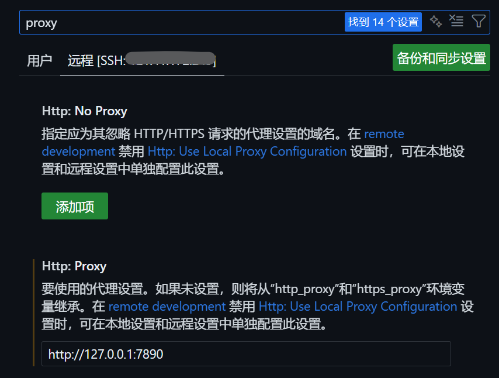

# 摆弄服务器的记录
用的是阿里云的99包年，继之前的qq机器人之后又零散整了一些活.

## 在服务器上配置vpn使用CodeX

阿里云的Linux发行版类型选择成Ubuntu, 然后在服务器的终端运行```sudo apt install -y ubuntu-desktop```来安装图形界面.

选择了[FlClash-0.8.91-linux-amd64.AppImage
](https://github.com/chen08209/FlClash/releases)作为机场, 上传到服务器端的桌面.

在阿里云控制台使用VNC登录, 打开appimage即可. 关闭VNC的标签页并不会自动关闭图形界面, 所以可以使其一直运行.

当然, 此时并不意味着代理可以在VScode的ssh终端的CodeX CLI里或者VScode 的CodeX插件中使用, 因为ssh会话和VNC连接的图形界面是不同的会话. Linux的对终端间的隔离包括登录会话作用域和进程树作用域, 比如不同用户的```~/.bash_profile``` / ```~/.bash_login``` / ```~/.profile``是分开的, 不同用户创建的会话会注入不同的环境, 而进程树作用域是指某个终端的环境变量只对该终端的子进程有效. 所以此时只在图形界面终端可以使用VPN, 因为FlClash本质是设置了环境变量为127.0.0.1:7890.

另外一个问题是, 如果直接在VScode的ssh打开FlClash的app image, 会显示因为缺失显示器从而无法启动: 
``` bash
root@iZbp18go8yddw5y53guhdbZ:/home/yuqizhang/Desktop# ./FlClash-0.8.91-linux-amd64.AppImage 
(com.follow.clash:54774): Gtk-WARNING **: 17:00:15.792: cannot open display:
```
这个问题是由于没有设置环境变量```DISPLAY```, 可以通过将图形界面的```DISPLAY```设置为ssh终端的```DISPLAY```来解决. 在VNC连接的图形界面打开终端, 通过```echo $DISPLAY```查看到VNC的图形界面为```:0```, 因此在ssh终端中也应设置```$DISPLAY = :0```. 此时若直接访问会显示```Authorization required```, 这与xhost的配置有关. xhost是为X Window系统中控制x服务器访问权限的工具, x服务器是负责Linux系统的GUI绘制渲染和处理GUI输入事件的程序. 因为ssh终端的root用户无权访问图形界面(user用户登录), 所以无法打开. 此时在图形界面的终端中输入```xhost +si:localuser:root```向用户root授予权限即可.

因此, 在我ssh登录的root用户的```~/.bashrc```中添加了如下逻辑, 是的在每次启动root用户的ssh连接时
1. 设置环境变量```DISPLAY=":0"```
2. 使用```ps -a```检查FlClash进程是否存在, 若不存在则运行```/home/yuqizhang/Desktop/FlClash-0.8.91-linux-amd64.AppImage```
3. 如果FlClash启动成功或者已经在运行, 输出“ FlClash SSH bootstrap: FlClash is already running.", 再进行PROXY环境变量设置,而后输出"PROXY setup success"+ 各代理环境变量的代理地址:
    ``` bash
    HTTP_PROXY="http://127.0.0.1:7890" HTTPS_PROXY="$HTTP_PROXY"
    ALL_PROXY="socks5h://127.0.0.1:7890"
    NO_PROXY="localhost,127.0.0.1"
    ```
4. 若FlClash启动失败, 输出"FlClash SSH bootstrap: FlClash lauch fail."并输出"PROXY setup fail."

bash脚本如下:
``` bash
# ===== FlClash + proxy bootstrap for SSH interactive shells =====

# Only run in interactive shells
case "$-" in
  *i*) ;;
  *) return ;;
esac

# Only run for SSH sessions
if [ -z "${SSH_CONNECTION:-}" ] && [ -z "${SSH_TTY:-}" ]; then
  return
fi

# 1) DISPLAY (assumes local GUI session is :0)
export DISPLAY="${DISPLAY:-:0}"

FLCLASH_APPIMAGE="/home/yuqizhang/Desktop/FlClash-0.8.91-linux-amd64.AppImage"
FLCLASH_LOG="/var/log/flclash-ssh-autostart.log"
FLCLASH_LOCK="/tmp/flclash-autostart.lock"

# Helper: check whether FlClash is running
_flclash_is_running() {
  pgrep -x "FlClash" >/dev/null 2>&1 && return 0
  pgrep -f "FlClashCore" >/dev/null 2>&1 && return 0
  return 1
}

# Helper: attempt to launch FlClash (detached)
_flclash_launch() {
  [ -x "$FLCLASH_APPIMAGE" ] || return 1
  ( nohup "$FLCLASH_APPIMAGE" >>"$FLCLASH_LOG" 2>&1 & ) >/dev/null 2>&1
  return 0
}

# Ensure FlClash is running; return 0 on success, 1 on failure
_ensure_flclash() {
  # Fast path
  _flclash_is_running && return 0

  # If flock exists, prevent concurrent multiple starts
  if command -v flock >/dev/null 2>&1; then
    exec 9>"$FLCLASH_LOCK" || true
    if flock -n 9; then
      # We hold the lock; try launching
      _flclash_launch || true

      # Wait briefly for the process to appear (non-blocking, short)
      for _i in 1 2 3 4 5; do
        _flclash_is_running && break
        sleep 0.3
      done

      flock -u 9 || true
    else
      # Another session may be starting it; wait a moment and recheck
      for _i in 1 2 3 4 5; do
        _flclash_is_running && break
        sleep 0.3
      done
    fi
    exec 9>&- || true
  else
    # No flock: best-effort start with a small wait
    _flclash_launch || true
    for _i in 1 2 3 4 5; do
      _flclash_is_running && break
      sleep 0.3
    done
  fi

  _flclash_is_running && return 0
  return 1
}

# Main logic
if _ensure_flclash; then
  echo " FlClash SSH bootstrap: FlClash is already running."

  # 3) Proxy env vars (only set on success)
  export HTTP_PROXY="http://127.0.0.1:7890"
  export HTTPS_PROXY="$HTTP_PROXY"
  export ALL_PROXY="socks5h://127.0.0.1:7890"
  export NO_PROXY="localhost,127.0.0.1"

  echo "PROXY setup success"
  echo "HTTP_PROXY=$HTTP_PROXY"
  echo "HTTPS_PROXY=$HTTPS_PROXY"
  echo "ALL_PROXY=$ALL_PROXY"
  echo "NO_PROXY=$NO_PROXY"
else
  echo " FlClash SSH bootstrap: FlClash lauch fail."
  unset HTTP_PROXY HTTPS_PROXY ALL_PROXY NO_PROXY
  echo "PROXY setup fail."
fi
# ===== end bootstrap =====
```

在进行了如上设置后, 为了使CodeX的VSCode插件(安装在服务器端)能够顺畅使用, 还要在VScode中配置http.proxy(在服务器端)

## 阿里云服务器+腾讯云邮件推送服务搭建邮件服务器

## 目录
<!-- auto-toc:start -->
<!-- auto-toc:end -->
